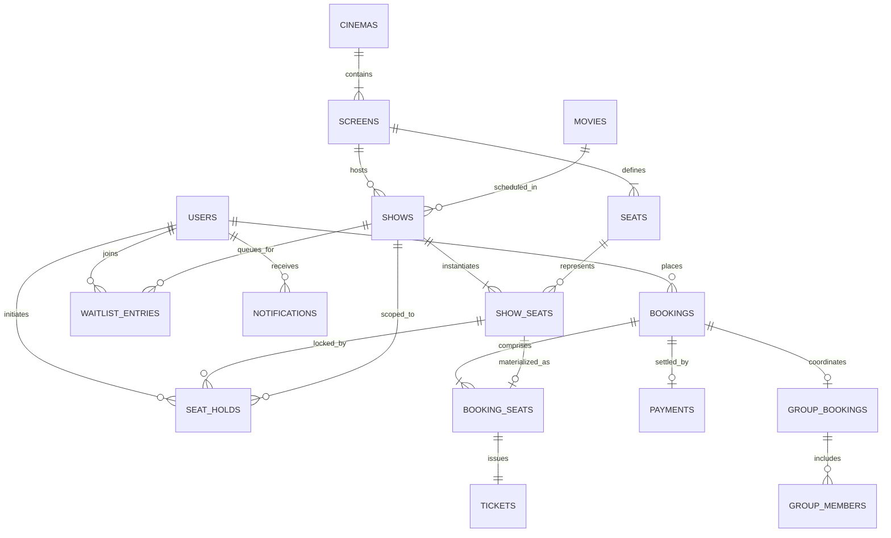

# CineSmart — Smart Movie Ticket Booking System
## Document 07: Database Design & Relational Specifications

---

### Document Control
* **Document Version:** 1.0.0
* **Target Engine:** PostgreSQL 15+
* **Phase:** Phase 1 — Data Modeling & Persistence Specifications

---

## 1. Relational Entity-Relationship (ER) Architecture

The CineSmart relational model separates the physical physical theater infrastructure (cinemas, screens, physical seats) from the time-specific exhibition inventory (shows, show seats), transactional records (bookings, booking seats, payments, tickets), and dynamic operations (seat holds, waitlists, group metadata).



---

## 2. Deep Architectural Rationale: Entity Separation

In naive student database designs, students often merge `Seat`, `ShowSeat`, and `BookingSeat` into a single entity. CineSmart deliberately models these as three distinct entities for fundamental OOAD and database normalization reasons:

### 2.1 Why `ShowSeat` is Different from `Seat`
* **`Seat` (Physical Asset):** Represents the immutable physical fixture in a real screen (e.g., Screen 1, Row F, Seat 8, Recliner tier, spatial coordinates $X=8, Y=6$). It exists permanently regardless of whether any movies are scheduled.
* **`ShowSeat` (Perishable Temporal Inventory):** Represents the availability of that physical seat for a specific point in time (e.g., Show #101 on Friday at 7:00 PM). It tracks transient transactional states (`AVAILABLE`, `HELD`, `BOOKED`, `WAITLIST_OFFERED`) and showtime-specific price adjustments.
* **Separation Benefit:** Physical seats are configured once by administrators; shows instantiate their own inventory rows. One screen holding 200 seats can host 1,000 distinct shows per year without physical seat data mutation.

### 2.2 Why `BookingSeat` is Needed (Historical Immutability & Decoupling)
* If a booking only referenced `ShowSeat`, any future catalog price adjustment or showtime archival would alter historical accounting records.
* **`BookingSeat` (Financial Snapshot):** Captures the exact historical price paid (`snapshot_price`), the seat tier snapshot, and the row/seat identifier string at the moment the transaction occurred. Even if the theater subsequently renumbers seats, deletes the show, or changes ticket prices, the customer's legal financial invoice remains completely immutable.

---

## 3. Comprehensive Table Specifications

---

### 3.1 Table: `users`
Stores customer, staff, and administrator account credentials and roles.

| Column Name | Data Type | Nullable | Constraints & Defaults | Description |
| :--- | :--- | :--- | :--- | :--- |
| `id` | `BIGSERIAL` | No | `PRIMARY KEY` | Unique user identifier |
| `email` | `VARCHAR(150)` | No | `UNIQUE` | Normalized email address for login |
| `password_hash` | `VARCHAR(255)` | No | | BCrypt hashed password |
| `full_name` | `VARCHAR(100)` | No | | User display name |
| `phone_number` | `VARCHAR(20)` | Yes | | Mobile phone number |
| `role` | `VARCHAR(30)` | No | `DEFAULT 'ROLE_CUSTOMER'` | Enum: `ROLE_CUSTOMER`, `ROLE_STAFF`, `ROLE_ADMIN` |
| `is_active` | `BOOLEAN` | No | `DEFAULT TRUE` | Soft-disable flag |
| `created_at` | `TIMESTAMP WITH TIME ZONE` | No | `DEFAULT CURRENT_TIMESTAMP` | Account creation timestamp |

* **Check Constraints:** `CHECK (role IN ('ROLE_CUSTOMER', 'ROLE_STAFF', 'ROLE_ADMIN'))`
* **Indexes:** `CREATE UNIQUE INDEX idx_users_email ON users(email);`

---

### 3.2 Table: `movies`
Stores catalog metadata for screened films.

| Column Name | Data Type | Nullable | Constraints & Defaults | Description |
| :--- | :--- | :--- | :--- | :--- |
| `id` | `BIGSERIAL` | No | `PRIMARY KEY` | Movie identifier |
| `title` | `VARCHAR(200)` | No | | Film title |
| `synopsis` | `TEXT` | Yes | | Plot overview |
| `duration_minutes` | `INT` | No | `CHECK (duration_minutes > 0)` | Runtime in minutes |
| `language` | `VARCHAR(50)` | No | | Primary spoken language |
| `genre` | `VARCHAR(50)` | No | | Genre classification (e.g., Action, Sci-Fi) |
| `age_rating` | `VARCHAR(10)` | No | | Certification (e.g., PG-13, R, U/A) |
| `poster_url` | `VARCHAR(500)` | Yes | | URL to poster image asset |
| `is_active` | `BOOLEAN` | No | `DEFAULT TRUE` | Catalog visibility flag |
| `created_at` | `TIMESTAMP WITH TIME ZONE` | No | `DEFAULT CURRENT_TIMESTAMP` | Ingestion timestamp |

* **Indexes:** `CREATE INDEX idx_movies_title ON movies(title);`, `CREATE INDEX idx_movies_genre ON movies(genre);`

---

### 3.3 Table: `cinemas` & `screens`
Defines theater facilities and screening auditoriums.

#### Table: `cinemas`
| Column Name | Data Type | Nullable | Constraints & Defaults | Description |
| :--- | :--- | :--- | :--- | :--- |
| `id` | `BIGSERIAL` | No | `PRIMARY KEY` | Cinema theater complex ID |
| `name` | `VARCHAR(150)` | No | | Theater brand & location name |
| `city` | `VARCHAR(100)` | No | | City location |
| `address` | `TEXT` | No | | Physical street address |
| `contact_number` | `VARCHAR(20)` | Yes | | Box office telephone |

#### Table: `screens`
| Column Name | Data Type | Nullable | Constraints & Defaults | Description |
| :--- | :--- | :--- | :--- | :--- |
| `id` | `BIGSERIAL` | No | `PRIMARY KEY` | Screen identifier |
| `cinema_id` | `BIGINT` | No | `REFERENCES cinemas(id) ON DELETE CASCADE` | Parent cinema facility |
| `screen_number` | `INT` | No | | Hall number (e.g., Screen 1) |
| `screen_type` | `VARCHAR(30)` | No | `DEFAULT 'STANDARD'` | `STANDARD`, `IMAX_3D`, `DOLBY_ATMOS` |
| `total_capacity` | `INT` | No | `CHECK (total_capacity > 0)` | Total physical seat count |

* **Constraints:** `UNIQUE(cinema_id, screen_number)`

---

### 3.4 Table: `seats` (Physical Master Grid)
Stores the physical seating geometry for each auditorium screen.

| Column Name | Data Type | Nullable | Constraints & Defaults | Description |
| :--- | :--- | :--- | :--- | :--- |
| `id` | `BIGSERIAL` | No | `PRIMARY KEY` | Physical seat ID |
| `screen_id` | `BIGINT` | No | `REFERENCES screens(id) ON DELETE CASCADE` | Screen auditorium |
| `row_identifier` | `VARCHAR(5)` | No | | Row letter (e.g., A, B, C... J) |
| `column_number` | `INT` | No | | Seat number in row (e.g., 1 to 20) |
| `seat_tier` | `VARCHAR(30)` | No | `DEFAULT 'STANDARD'` | `STANDARD`, `PREMIUM`, `RECLINER`, `ACCESSIBLE_WHEELCHAIR`, `ACCESSIBLE_COMPANION` |
| `grid_x` | `INT` | No | | Matrix column coordinate for visual UI |
| `grid_y` | `INT` | No | | Matrix row coordinate for visual UI |
| `is_active` | `BOOLEAN` | No | `DEFAULT TRUE` | Maintenance flag |

* **Constraints:** `UNIQUE(screen_id, row_identifier, column_number)`
* **Check Constraints:** `CHECK (seat_tier IN ('STANDARD', 'PREMIUM', 'RECLINER', 'ACCESSIBLE_WHEELCHAIR', 'ACCESSIBLE_COMPANION'))`

---

### 3.5 Table: `shows`
Represents scheduled movie screenings.

| Column Name | Data Type | Nullable | Constraints & Defaults | Description |
| :--- | :--- | :--- | :--- | :--- |
| `id` | `BIGSERIAL` | No | `PRIMARY KEY` | Scheduled show ID |
| `movie_id` | `BIGINT` | No | `REFERENCES movies(id) ON DELETE RESTRICT` | Screened film |
| `screen_id` | `BIGINT` | No | `REFERENCES screens(id) ON DELETE RESTRICT` | Auditorium |
| `start_time` | `TIMESTAMP WITH TIME ZONE` | No | | Showtime commencement |
| `end_time` | `TIMESTAMP WITH TIME ZONE` | No | | Showtime conclusion |
| `base_price` | `NUMERIC(10, 2)` | No | `CHECK (base_price >= 0)` | Standard base tier ticket price |
| `status` | `VARCHAR(30)` | No | `DEFAULT 'SCHEDULED'` | `SCHEDULED`, `IN_PROGRESS`, `COMPLETED`, `CANCELLED` |

* **Check Constraints:** `CHECK (end_time > start_time)`, `CHECK (status IN ('SCHEDULED', 'IN_PROGRESS', 'COMPLETED', 'CANCELLED'))`
* **Indexes:** `CREATE INDEX idx_shows_screen_time ON shows(screen_id, start_time);`, `CREATE INDEX idx_shows_movie_time ON shows(movie_id, start_time);`

---

### 3.6 Table: `show_seats` (Per-Show Inventory)
The heart of real-time seat status and concurrency control.

| Column Name | Data Type | Nullable | Constraints & Defaults | Description |
| :--- | :--- | :--- | :--- | :--- |
| `id` | `BIGSERIAL` | No | `PRIMARY KEY` | Show-seat inventory ID |
| `show_id` | `BIGINT` | No | `REFERENCES shows(id) ON DELETE CASCADE` | Associated show |
| `seat_id` | `BIGINT` | No | `REFERENCES seats(id) ON DELETE RESTRICT` | Physical seat referenced |
| `status` | `VARCHAR(30)` | No | `DEFAULT 'AVAILABLE'` | `AVAILABLE`, `HELD`, `BOOKED`, `BLOCKED`, `WAITLIST_OFFERED` |
| `price` | `NUMERIC(10, 2)` | No | `CHECK (price >= 0)` | Adjusted price for this show |
| `version` | `BIGINT` | No | `DEFAULT 0` | Optimistic locking version number |

* **Constraints:** `UNIQUE(show_id, seat_id)`
* **Check Constraints:** `CHECK (status IN ('AVAILABLE', 'HELD', 'BOOKED', 'BLOCKED', 'WAITLIST_OFFERED'))`
* **Indexes:** `CREATE INDEX idx_show_seats_lookup ON show_seats(show_id, status);`

---

### 3.7 Table: `seat_holds` (Temporary Reservation Holds)
Tracks countdown holds and locks during checkout.

| Column Name | Data Type | Nullable | Constraints & Defaults | Description |
| :--- | :--- | :--- | :--- | :--- |
| `id` | `BIGSERIAL` | No | `PRIMARY KEY` | Hold record ID |
| `hold_token` | `VARCHAR(64)` | No | `UNIQUE` | Cryptographic UUID hold reference |
| `user_id` | `BIGINT` | No | `REFERENCES users(id) ON DELETE CASCADE` | Patron placing hold |
| `show_id` | `BIGINT` | No | `REFERENCES shows(id) ON DELETE CASCADE` | Target show |
| `show_seat_id` | `BIGINT` | No | `REFERENCES show_seats(id) ON DELETE CASCADE` | Specific seat locked |
| `status` | `VARCHAR(30)` | No | `DEFAULT 'ACTIVE'` | `ACTIVE`, `EXPIRED`, `CONVERTED_TO_BOOKING`, `RELEASED` |
| `created_at` | `TIMESTAMP WITH TIME ZONE` | No | `DEFAULT CURRENT_TIMESTAMP` | Hold creation timestamp |
| `expires_at` | `TIMESTAMP WITH TIME ZONE` | No | | Expiration timestamp (e.g., +8 mins) |

* **Critical Partial Unique Index (Prevention of Duplicate Active Holds):**
  ```sql
  CREATE UNIQUE INDEX idx_unique_active_hold_per_show_seat 
  ON seat_holds (show_seat_id) 
  WHERE status = 'ACTIVE';
  ```
  *Design Rationale:* This partial unique index guarantees at the PostgreSQL database engine level that no two concurrent transactions can ever insert an `ACTIVE` hold on the same `show_seat_id`, regardless of application-layer bugs or race conditions.

---

### 3.8 Table: `bookings`
Parent entity managing transaction state.

| Column Name | Data Type | Nullable | Constraints & Defaults | Description |
| :--- | :--- | :--- | :--- | :--- |
| `id` | `BIGSERIAL` | No | `PRIMARY KEY` | Booking ID |
| `booking_reference` | `VARCHAR(32)` | No | `UNIQUE` | Human-readable ref (e.g., `CS-2026-9041`) |
| `user_id` | `BIGINT` | No | `REFERENCES users(id) ON DELETE RESTRICT` | Booking customer |
| `show_id` | `BIGINT` | No | `REFERENCES shows(id) ON DELETE RESTRICT` | Reserved show |
| `total_amount` | `NUMERIC(10, 2)` | No | `CHECK (total_amount >= 0)` | Total price including taxes |
| `status` | `VARCHAR(30)` | No | `DEFAULT 'PENDING_PAYMENT'` | `PENDING_PAYMENT`, `PAYMENT_PENDING_VERIFICATION`, `CONFIRMED`, `CANCELLED`, `CANCELLED_BY_CINEMA`, `EXPIRED` |
| `created_at` | `TIMESTAMP WITH TIME ZONE` | No | `DEFAULT CURRENT_TIMESTAMP` | Creation timestamp |
| `confirmed_at` | `TIMESTAMP WITH TIME ZONE` | Yes | | Payment confirmation timestamp |

* **Check Constraints:** `CHECK (status IN ('PENDING_PAYMENT', 'PAYMENT_PENDING_VERIFICATION', 'CONFIRMED', 'CANCELLED', 'CANCELLED_BY_CINEMA', 'EXPIRED'))`
* **Indexes:** `CREATE INDEX idx_bookings_user ON bookings(user_id);`, `CREATE INDEX idx_bookings_status ON bookings(status);`

---

### 3.9 Table: `booking_seats`
Itemized line-item snapshot of each seat within a booking.

| Column Name | Data Type | Nullable | Constraints & Defaults | Description |
| :--- | :--- | :--- | :--- | :--- |
| `id` | `BIGSERIAL` | No | `PRIMARY KEY` | Line item ID |
| `booking_id` | `BIGINT` | No | `REFERENCES bookings(id) ON DELETE CASCADE` | Parent booking |
| `show_seat_id` | `BIGINT` | No | `REFERENCES show_seats(id) ON DELETE RESTRICT` | Reserved show seat |
| `snapshot_price` | `NUMERIC(10, 2)` | No | `CHECK (snapshot_price >= 0)` | Immutable price captured at reservation |
| `seat_label` | `VARCHAR(10)` | No | | Snapshot label (e.g., "F-8") |
| `tier_snapshot` | `VARCHAR(30)` | No | | Snapshot of seat tier at time of purchase |

* **Critical Unique Constraint (Prevention of Duplicate Confirmed Seats):**
  ```sql
  CREATE UNIQUE INDEX idx_unique_confirmed_seat_per_show
  ON booking_seats (show_seat_id);
  ```
  *(Note: Enforced via transaction lifecycle and application cascading, or scoped to non-cancelled bookings).*

---

### 3.10 Table: `payments`
Tracks monetary transactions, gateway tokens, and reconciliation state.

| Column Name | Data Type | Nullable | Constraints & Defaults | Description |
| :--- | :--- | :--- | :--- | :--- |
| `id` | `BIGSERIAL` | No | `PRIMARY KEY` | Payment record ID |
| `booking_id` | `BIGINT` | No | `REFERENCES bookings(id) ON DELETE RESTRICT` | Associated booking |
| `idempotency_key` | `VARCHAR(64)` | No | `UNIQUE` | Unique token preventing duplicate charges |
| `gateway_txn_id` | `VARCHAR(100)` | Yes | | External payment provider transaction reference |
| `amount` | `NUMERIC(10, 2)` | No | `CHECK (amount > 0)` | Debited financial amount |
| `payment_method` | `VARCHAR(30)` | No | | `CARD`, `UPI`, `NET_BANKING`, `SIMULATED_MOCK` |
| `status` | `VARCHAR(30)` | No | `DEFAULT 'PENDING'` | `PENDING`, `SUCCESS`, `FAILED`, `PENDING_RECONCILIATION`, `REFUNDED` |
| `failure_reason` | `VARCHAR(255)` | Yes | | Error message if declined |
| `created_at` | `TIMESTAMP WITH TIME ZONE` | No | `DEFAULT CURRENT_TIMESTAMP` | Attempt timestamp |
| `reconciled_at` | `TIMESTAMP WITH TIME ZONE` | Yes | | Background reconciliation timestamp |

* **Check Constraints:** `CHECK (status IN ('PENDING', 'SUCCESS', 'FAILED', 'PENDING_RECONCILIATION', 'REFUNDED'))`

---

### 3.11 Table: `tickets`
Digital tickets issued to patrons for cinema entry.

| Column Name | Data Type | Nullable | Constraints & Defaults | Description |
| :--- | :--- | :--- | :--- | :--- |
| `id` | `BIGSERIAL` | No | `PRIMARY KEY` | Ticket identifier |
| `booking_seat_id` | `BIGINT` | No | `UNIQUE REFERENCES booking_seats(id) ON DELETE RESTRICT` | Exact seat booked |
| `ticket_code` | `VARCHAR(32)` | No | `UNIQUE` | Alphanumeric entry code |
| `qr_verification_hash`| `VARCHAR(255)`| No | | Cryptographic HMAC hash encoded in QR |
| `status` | `VARCHAR(20)` | No | `DEFAULT 'ISSUED'` | `ISSUED`, `USED`, `VOIDED` |
| `issued_at` | `TIMESTAMP WITH TIME ZONE` | No | `DEFAULT CURRENT_TIMESTAMP` | Issuance timestamp |
| `validated_at` | `TIMESTAMP WITH TIME ZONE` | Yes | | Gate scanning timestamp |
| `validated_by` | `BIGINT` | Yes | `REFERENCES users(id)` | Cinema staff member who scanned ticket |

* **Check Constraints:** `CHECK (status IN ('ISSUED', 'USED', 'VOIDED'))`

---

### 3.12 Tables: `group_bookings` & `group_members`
Facilitates collaborative group ticketing coordination.

#### Table: `group_bookings`
| Column Name | Data Type | Nullable | Constraints & Defaults | Description |
| :--- | :--- | :--- | :--- | :--- |
| `id` | `BIGSERIAL` | No | `PRIMARY KEY` | Group booking identifier |
| `booking_id` | `BIGINT` | No | `UNIQUE REFERENCES bookings(id) ON DELETE CASCADE` | Underlying confirmed booking |
| `group_name` | `VARCHAR(100)` | No | | Friendly name (e.g., "Avengers Squad") |
| `shareable_token`| `VARCHAR(64)` | No | `UNIQUE` | Token for read-only itinerary link |

#### Table: `group_members`
| Column Name | Data Type | Nullable | Constraints & Defaults | Description |
| :--- | :--- | :--- | :--- | :--- |
| `id` | `BIGSERIAL` | No | `PRIMARY KEY` | Member record ID |
| `group_booking_id`| `BIGINT` | No | `REFERENCES group_bookings(id) ON DELETE CASCADE` | Parent group |
| `booking_seat_id` | `BIGINT` | Yes | `REFERENCES booking_seats(id) ON DELETE SET NULL` | Specific seat assigned to member |
| `member_name` | `VARCHAR(100)` | No | | Name of attendee |
| `member_email` | `VARCHAR(150)` | Yes | | Contact email for itinerary |

---

### 3.13 Table: `waitlist_entries`
Manages fair priority queuing for sold-out showings.

| Column Name | Data Type | Nullable | Constraints & Defaults | Description |
| :--- | :--- | :--- | :--- | :--- |
| `id` | `BIGSERIAL` | No | `PRIMARY KEY` | Waitlist entry ID |
| `show_id` | `BIGINT` | No | `REFERENCES shows(id) ON DELETE CASCADE` | Target sold-out show |
| `user_id` | `BIGINT` | No | `REFERENCES users(id) ON DELETE CASCADE` | Waiting customer |
| `requested_party_size` | `INT` | No | `CHECK (requested_party_size BETWEEN 1 AND 10)` | Desired group size |
| `preferred_tier` | `VARCHAR(30)` | Yes | | Optional preferred seat tier |
| `status` | `VARCHAR(20)` | No | `DEFAULT 'WAITING'` | `WAITING`, `OFFERED`, `FULFILLED`, `EXPIRED`, `CANCELLED` |
| `claim_token` | `VARCHAR(64)` | Yes | `UNIQUE` | Secret URL token to claim offer |
| `offer_expires_at`| `TIMESTAMP WITH TIME ZONE` | Yes | | 10-minute claim deadline |
| `created_at` | `TIMESTAMP WITH TIME ZONE` | No | `DEFAULT CURRENT_TIMESTAMP` | Queue registration timestamp |

* **Constraints:** `UNIQUE(show_id, user_id)` (A user can only hold one waitlist queue slot per show)
* **Check Constraints:** `CHECK (status IN ('WAITING', 'OFFERED', 'FULFILLED', 'EXPIRED', 'CANCELLED'))`
* **Indexes:** `CREATE INDEX idx_waitlist_queue ON waitlist_entries(show_id, status, created_at);`

---

### 3.14 Table: `audit_logs`
Append-only log for security, administrative actions, and concurrency auditability.

| Column Name | Data Type | Nullable | Constraints & Defaults | Description |
| :--- | :--- | :--- | :--- | :--- |
| `id` | `BIGSERIAL` | No | `PRIMARY KEY` | Audit entry ID |
| `event_type` | `VARCHAR(50)` | No | | `SEAT_HELD`, `SEAT_RELEASED`, `PAYMENT_RECONCILED`, `TICKET_VALIDATED`, `SHOW_CANCELLED` |
| `user_id` | `BIGINT` | Yes | | Actor responsible (if applicable) |
| `entity_name` | `VARCHAR(50)` | No | | Affected table (e.g., `show_seats`) |
| `entity_id` | `BIGINT` | No | | Affected record PK |
| `details_json` | `JSONB` | Yes | | Structured snapshot of state transition |
| `occurred_at` | `TIMESTAMP WITH TIME ZONE` | No | `DEFAULT CURRENT_TIMESTAMP` | Event timestamp |

---

## 4. Concurrency & Integrity Mechanics Summary

To guarantee zero double bookings and zero lost transactions under high concurrency:
1. **Isolation Level:** Transactions run under PostgreSQL's default `READ COMMITTED` isolation level, reinforced by explicit **Pessimistic Write Locking** (`SELECT ... FOR UPDATE`) on target rows in `show_seats`.
2. **Partial Unique Indexes:** As specified in Section 3.7, `idx_unique_active_hold_per_show_seat` prevents simultaneous insertion of two active holds for the same seat at the database constraint level.
3. **Idempotency Persistence:** Table `payments` strictly enforces `UNIQUE(idempotency_key)`, guaranteeing duplicate HTTP POST callbacks cannot generate dual charges.
